# Design patterns

## DesignPatterns_StudyLabs

### Creational patterns

#### 1. Abstract factory pattern

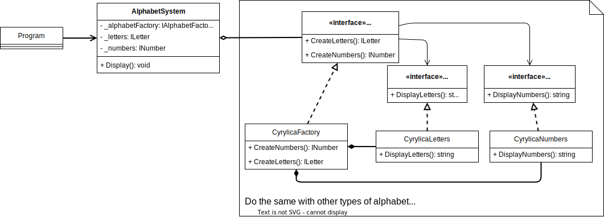

#### 2. Builder pattern

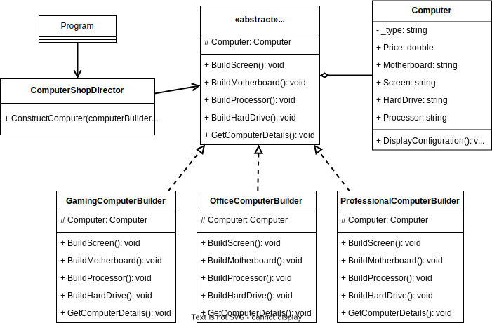

#### 3. Factory method pattern

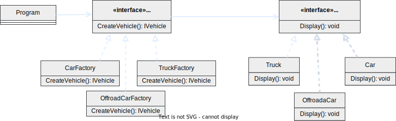

#### 4. Prototype pattern

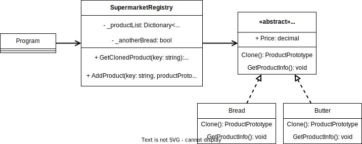

#### 5. Singleton pattern

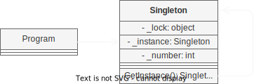

### Structural patterns

#### 1. Adapter pattern

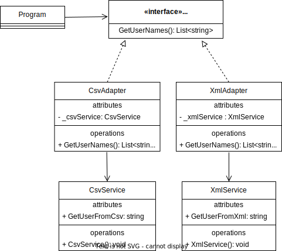

#### 2. Bridge pattern

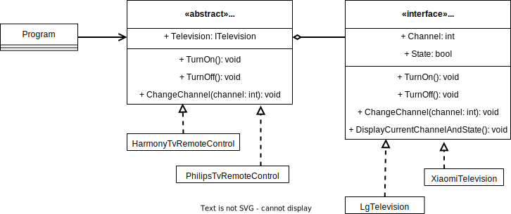

#### 3. Composite pattern

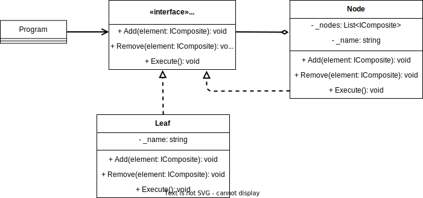

#### 4. Decorator pattern

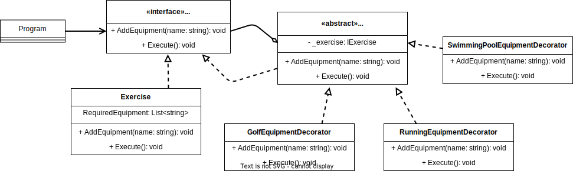

#### 5. Facade pattern

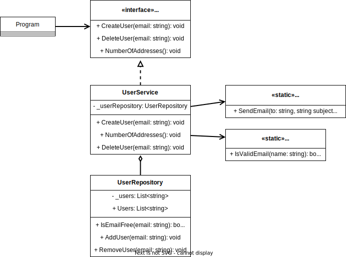

#### 6. Flyweight pattern

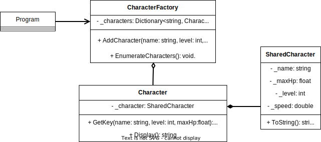

#### 7. Proxy pattern

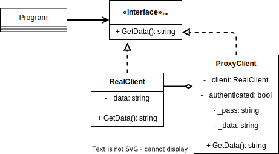
